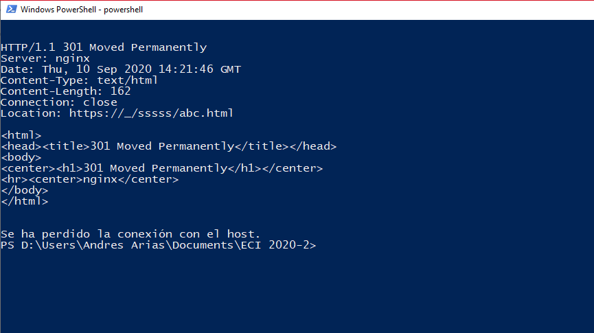
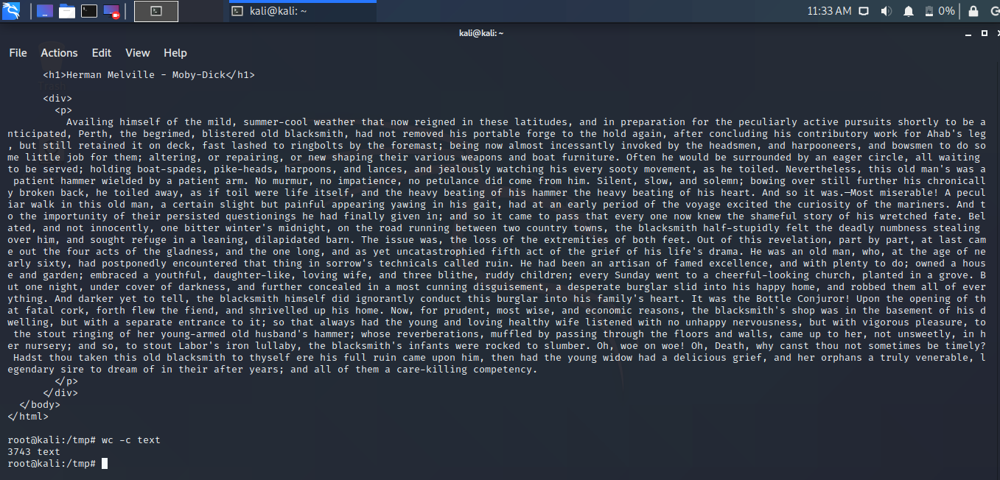
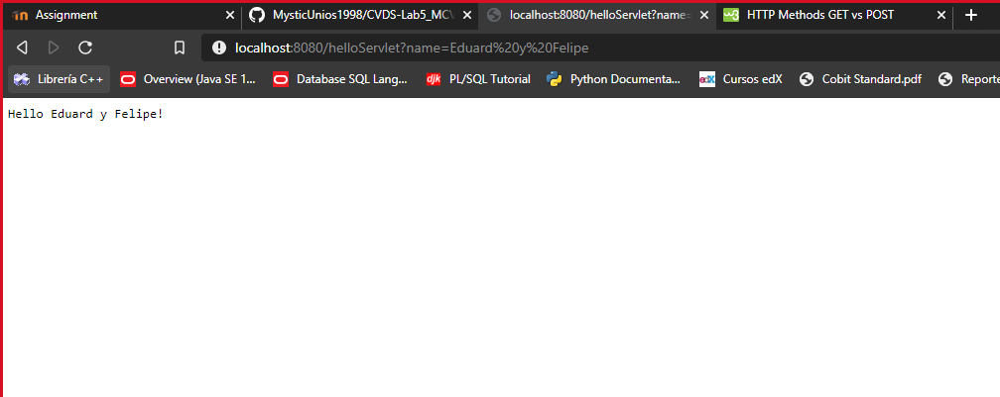
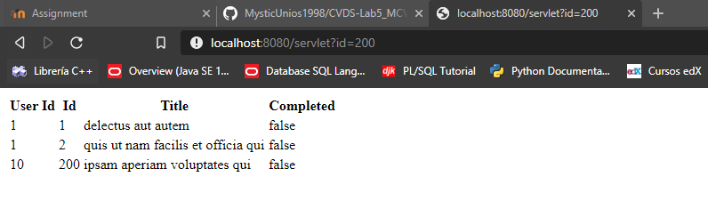
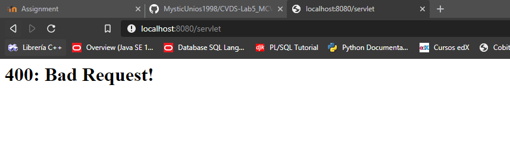
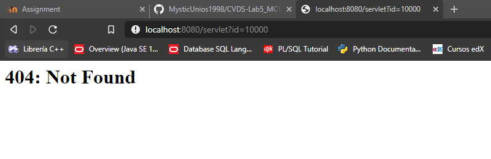

# **CVDS-Lab5_MCVPrimefaces**

## Integrantes

-   Eduard Arias
-   Felipe Marin

## **Parte I. - Jugando a ser un cliente HTTP**

1.  Utilizar el comando `telnet www.escuelaing.edu.co 80` para comenzar una conexión TCP/IP.
2.  Revisar el protocolo de transferencia HTTP.
    -   Comando: `GET / HTTP/<1.1|1.0>`
3.  Revise el resultado obtenido. ¿Qué codigo de error sale?, revise el significado del mismo en la lista de códigos de estado HTTP.

    -   El resultado es:

    

    -   El error significa que el recurso existe en la máquina pero que la URI utilizada es incorrecta.

4.  ¿Qué otros códigos de error existen?, ¿En qué caso se manejarán?

    -   Existen los siguientes códigos de manera general:

        1xx Informational response
        2xx Success
        3xx Redirection
        4xx Client errors
        5xx Server errors

    -   Los errores de tipo 4xx y 3xx se pueden manejar en la petición o en la máquina cliente. Los errores de servidor (5xx) usualmente están fueran de alcance.

5.  Realice una nueva conexión con telnet, esta vez a:

    -   Host: www.httpbin.org
    -   Puerto: 80
    -   Versión HTTP\: 1.1

    

6.  ¿Cuál es la diferencia entre los verbos GET y POST? ¿Qué otros tipos de peticiones existen?
    -   La diferencia entre GET y POST es que POST oculta los datos al enviarlos, mientras que GET muestra las peticiones en texto plano.
    -   Las peticiones HTTP son:
        		* GET: solicita una representación de un recurso específico. Las peticiones que usan el método GET sólo deben recuperar datos.
        		* HEAD: pide una respuesta idéntica a la de una petición GET, pero sin el cuerpo de la respuesta.
        		* POST: se utiliza para enviar una entidad a un recurso en específico, causando a menudo un cambio en el estado o efectos secundarios en el servidor.
        		* PUT: reemplaza todas las representaciones actuales del recurso de destino con la carga útil de la petición.
        		* DELETE: borra un recurso en específico.
        		* CONNECT: establece un túnel hacia el servidor identificado por el recurso.
        		* OPTIONS: es utilizado para describir las opciones de comunicación para el recurso de destino.
        		* TRACE: realiza una prueba de bucle de retorno de mensaje a lo largo de la ruta al recurso de destino.
        		\* PATCH: es utilizado para aplicar modificaciones parciales a un recurso.
7.  Utilizar ``curl [-v | -i]\`. ¿Cuáles son las diferencias con los diferentes parámetros?
    -   Los resultados están en [curl1][1] y [curl2][2]
    -   La diferencia entre -i y -v es que `curl -i` muestra los protocoloes de cabecera usados en la petición.

## **Parte II. - Haciendo una aplicación Web dinámica a bajo nivel**

1.  Para la creación del proyecto con el arquetipo 'webapp', se utilizó:
    `mvn archetype:generate -DgroupId=com.primefaces.web -DartifactId=Primefaces -DarchetypeArtifactId=maven-archetype-webapp -DinteractiveMode=false`

2.  El resultado de ejecutar `mvn tomcat7:run` y abrir la dirección ** es este:

3.  El resultado de la petición **GET** es:

4.  La dirección [json][3] nos muestra lo que parece ser un generador *Lorem-Ipsum* (texto aleatorio). Los números cambian el parámetro llamado 'id'.

5.  Para la ejecución del servidor tomcat, definimos nuestro servlet *OutServlet* que responde a la url */servlet*

6.  Ejecuciones:

## **Parte III.**

1.  Formulario web creado (POST):

2.  Validación de formulario:

3.  Al usar el método de petición `GET`, los atributos son mostrados en la URL

## **Parte IV. - Frameworks Web MVC – Java Server Faces / Prime Faces**

*Escriba una aplicación web que utilice PrimeFaces para calcular la media, la moda, la desviación estándar y varianza de un conjunto de N números reales. 
Este conjunto de N números reales deben ser ingresados por el usuario de manera que puedan ser utilizados para los cálculos.*

1.  Agregar las siguientes dependencias al POM:

        
        
            javax
            javaee-api
            7.0
            provided
        

        
        
            javax.servlet
            jstl
            1.2
        

        
        
            com.sun.faces
            jsf-api
            2.2.20
        

        
        
            com.sun.faces
            jsf-impl
            2.2.20
        

        
        
            org.primefaces
            primefaces
            8.0
        

2.  Las configuraciones al 'web.xml' son:

**Acerca de los descriptores de implementación**
Un descriptor de implementación de una aplicación web describe las clases, los recursos y la configuración de la aplicación y cómo los usa el servidor web para entregar solicitudes web. 
Cuando el servidor web recibe una solicitud para la aplicación, usa el descriptor de implementación con el fin de asignar la URL de la solicitud al código que debe controlarla.

    + **servlet** -> declara el servlet, lo que incluye un nombre que usan otros elementos en el archivo para referirse al servlet, la clase que se usará para el servlet y los parámetros de inicialización.
    + **servlet-mapping** -> especifica un patrón de URL y el nombre de un servlet declarado para usar con solicitudes cuya URL coincide con el patrón.
    + **welcome-file-list** -> El descriptor de implementación puede especificar una lista de nombres de archivo que el servidor debe probar cuando el usuario accede a una ruta que representa un subdirectorio del WAR (que no esté asignado de manera explícita a un servlet). El estándar de servlet llama a esto la “lista de archivos de bienvenida”. [OPCIONAL]

1.  La sección `` es opcional. Le dice al servidor que debe verificar esa URL cuando el usuario intente ingresar a ella.

2.  Ejecución correcta de la aplicación:

3.  Como está sujeta a la aplicación por la anotación `@AplicationScoped`, aunque sean navegadores o computadores diferentes, se mantienen los mismos valores.

4.  "(...)modifique el código del backing-bean de manera que use la anotación @SessionScoped en lugar de @ApplicationScoped. Reinicie la aplicación y repita el ejercicio anterior.
    Dado la anterior, ¿Cuál es la diferencia entre los backing-beans de sesión y los de aplicación?"

        + Cuando es `@SessionScoped`, los valores se mantienen para cada sesión. 

        

[1]: ./curl1.txt

[2]: ./curl2.txt

[3]: https://jsonplaceholder.typicode.com/todos/1